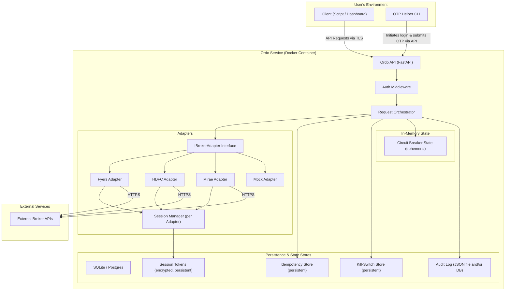

# Ordo
### One API. All brokers. Unified.

[](https://opensource.org/licenses/MIT)
[](https://python.org)
[](https://fastapi.tiangolo.com)
[](https://www.docker.com/)

**Ordo** is an open-source, self-hostable API gateway and orchestrator written in Python and built on FastAPI. It unifies individual broker integrations for the Indian market into a single, standardized, and resilient API. 

Instead of juggling different broker endpoints and quirks, Ordo gives developers and trading teams one reliable API for order execution, portfolio tracking, and market data.

---

## 📖 Table of Contents
- [What It Is](#what-it-is)
- [Why It Exists (The Problem it Solves)](#why-it-exists-the-problem-it-solves)
- [Key Features](#key-features)
- [System Architecture](#system-architecture)
- [Tech Stack](#tech-stack)
- [Roadmap & Current Status](#roadmap--current-status)
- [Getting Started (Local Running)](#getting-started-local-running)
- [Ordo CLI - Broker Login Guides](#ordo-cli---broker-login-guides)
  - [Fyers Login Guide](#fyers-login-guide)
  - [HDFC Securities Login Guide](#hdfc-securities-login-guide)
  - [Mock Broker Login Guide](#mock-broker-login-guide)
- [Docker Deployment](#docker-deployment)
- [References & Documentation](#references--documentation)

---

## 🔍 What It Is

Ordo is an open-source, self-hostable API gateway and orchestrator written in Python and built on FastAPI. It unifies individual broker integrations for the Indian market (with support for **Fyers**, **HDFC Securities**, and upcoming support for **Mirae m.Stock**) into a single, standardized, and resilient API. 

Ordo automates the complex daily authentication, session management, and OTP workflows required by brokers, and provides a concurrent request orchestrator that fans out requests to multiple brokers simultaneously. Designed as a lightweight backend-first infrastructure layer, it runs efficiently on minimal resources (1 vCPU and 1 GB RAM) to ensure low-cost self-hosting for retail algorithmic traders and small trading desks.

---

## 💡 Why It Exists (The Problem it Solves)

Building automated trading systems in India is needlessly difficult due to the fragmented broker ecosystem:

*   **API Fragmentation:** Every broker exposes different endpoint designs, rate limits, request/response formats, and error behaviors. Developers waste over **80% of their time** building and maintaining custom API integrations.
*   **Volatile Session Lifecycle:** Broker authentication expires daily, requiring custom redirect sequences, login APIs, and OTP challenges that disrupt live trading if not handled robustly.
*   **Trading Resilience Risks:** Live trading requires bulletproof safety boundaries. A simple network glitch or broker API timeout can result in untraceable duplicate order execution or inconsistent portfolio states.
*   **Proprietary Lock-in:** Existing middleware platforms are often closed-source, expensive SaaS models, or introduce high execution latency.

Ordo solves these issues by acting as a **clean, transparent, and self-hosted abstraction layer**. It normalizes all broker endpoints, automatically manages OTP-based daily logins, protects order placements with idempotency keys, and provides a global kill-switch for immediate risk mitigation.

---

## ✨ Key Features

*   **Unified Broker Adapters:** One standard internal schema for Fyers, HDFC Securities, and Mock adapters.
*   **Session Automation:** Automated session refresh and helper CLI scripts to relay OTPs securely.
*   **Concurrent Orchestration:** Concurrently fans out order/portfolio requests across multiple brokers and returns collated status reports.
*   **Resilience by Design:** Idempotency keys on all order actions, automatic retries with exponential backoff, and circuit breakers per adapter.
*   **Global Kill-Switch:** API endpoint to instantly halt all outgoing orders in an emergency.
*   **Minimal Footprint:** Built on an asynchronous Python stack (`asyncio`, `FastAPI`, `HTTPX`) optimized to run on a 1 vCPU, 1 GB RAM instance.

---

## 🏗️ System Architecture

Ordo uses a **modular monolithic** architecture following the **Ports and Adapters (Hexagonal)** design pattern. This isolates the core orchestration logic from individual broker API details.

### Architecture Diagram



---

## 🛠️ Tech Stack

| Category | Technology | Version | Purpose |
| :--- | :--- | :--- | :--- |
| **Language** | Python | 3.12 | Core application runtime |
| **Server** | Uvicorn / FastAPI | 0.117.1 | Async API framework & ASGI server |
| **HTTP Client** | HTTPX | 0.28.1 | Async non-blocking HTTP requests for broker fan-out |
| **Default DB** | SQLite | 3.38+ | File-based local relational store (Sessions, Idempotency, Kill-switch) |
| **Optional DB** | PostgreSQL | 15+ | Scalable database option for multi-instance deployments |
| **ORM** | SQLModel | 0.0.8+ | Async Pydantic + SQLAlchemy model mapper |
| **Security** | Cryptography | 41.0+ | Encrypts broker credentials & session tokens at rest |
| **Observability** | Structlog / Prometheus | 23.1+ | Structured JSON diagnostic logging & API metrics |
| **CLI Framework** | Typer | 0.9+ | CLI engine for user authentication / OTP input helper script |
| **Format & Lint** | Black & Ruff | latest | Automated linting, code formatting, and quality checks |

---

## 🗺️ Roadmap & Current Status

The project is structured into incremental milestones:

### ⬜ Milestone 0: Project Setup & Scaffolding
- [x] Standardized project structure & Poetry setup
- [x] FastAPI base application and `/health` check endpoint
- [x] Pre-commit hooks, formatting with `black`, linting with `ruff`

### 🏗️ Milestone 1: Core Foundation & Fyers Integration
- [x] Protected endpoints with static API bearer token validation
- [x] Defined standard `IBrokerAdapter` interfaces and mock adapter
- [x] Fyers Broker Adapter authentication & session persistence
- [x] OTP CLI Helper tool for terminal-based daily authentication logins
- [x] Portfolio lookup and asset balance retrieval via adapters

### 🏗️ Milestone 2: Multi-Broker Orchestration & Orders
- [/] Implement HDFC Securities Adapter (Completed) and Mirae m.Stock Adapter (Planned)
- [ ] Create Central Request Orchestrator service
- [ ] Async parallel request fan-out and collation handling
- [ ] Idempotency key tracking in DB and automated retries
- [ ] Pre-trade validation checks (symbol tradability, fund margin checks)
- [ ] Append-only structured Audit log persistence

### ⬜ Milestone 3: Advanced Resilience, Scaling & SDK
- [ ] Memory-based circuit breakers per adapter
- [ ] Global API Kill-Switch control
- [ ] `/status` diagnostics endpoint detailing adapters connection status
- [ ] PostgreSQL migration & Redis caching options
- [ ] Python client SDK & PyPI distribution packaging
- [ ] Docker image compilation and Docker Hub repository publishing

---

## 🚀 Getting Started (Local Running)

For full setup instructions, see the [quickstart.md](docs/quickstart.md) document.

### Prerequisites
*   **Python 3.12+**
*   **Poetry** (Python dependency management tool)

### 1. Install Dependencies
```bash
# Verify Python version
python --version

# Install poetry if not present
pip install poetry

# Install dependencies (creates a virtual environment automatically)
poetry install
```

### 2. Configure Environment Variables
Copy the template `.env.example` file to `.env` and fill out your credentials:
```bash
cp .env.example .env
```

### 3. Start the Local Server
Launch the server in reload/development mode via Uvicorn:
```bash
poetry run uvicorn ordo.main:app --reload --port 8000
```
*   **API Root:** `http://localhost:8000`
*   **Interactive API Docs (Swagger):** `http://localhost:8000/docs`
*   **Alternative Docs (ReDoc):** `http://localhost:8000/redoc`

### 4. Run the Test Suite
Execute tests and generate coverage analysis report:
```bash
# Run tests
poetry run pytest

# Check coverage metrics
poetry run pytest --cov=src/ordo --cov-report=term-missing
```

### 5. Format and Lint Code
Ensure your contributions comply with project styling requirements before committing:
```bash
poetry run ruff check src tests --fix
poetry run black src tests
```

---

## 🛠️ Ordo CLI - Broker Login Guides

The interactive CLI tool manages daily authentication and OTP flows.

### Prerequisites
1.  **Ordo API Server Running:** Your Ordo API server must be running and accessible (defaults to `http://localhost:8000`).
2.  **ngrok (For Fyers only):** Used to expose your local redirect endpoint to the internet.

---

### Fyers Login Guide

#### 1. Fyers Developer Account App Configuration
Create an app on the Fyers Developer Portal with:
*   **Redirect URL:** Set to your ngrok URL (e.g., `https://your-subdomain.ngrok-free.app`).

#### 2. Set Credentials
Provide Fyers credentials in your `.env` file or pass them as CLI options:
```ini
FYERS_APP_ID="your_fyers_app_id"
FYERS_SECRET_ID="your_fyers_secret_id"
FYERS_REDIRECT_URI="your_ngrok_url"
```

#### 3. Run the CLI Login Command
```bash
poetry run python -m scripts.otp_cli login --broker fyers
```
*(If credentials are not set in `.env`, pass them: `--app-id "..." --secret-id "..." --redirect-uri "..."`)*

#### 4. Authenticate
1. Copy the **login URL** printed in the terminal and paste it into your browser.
2. Log in with your Fyers credentials.
3. Upon redirection, copy the **entire redirect URL** from your browser's address bar (e.g., `https://.../?s=ok&code=200&auth_code=...&state=...`).
4. Paste the full URL back into the terminal prompt.

---

### HDFC Securities Login Guide

#### 1. Set Credentials
Set the following credentials in your `.env` file or pass them as CLI options:
```ini
HDFC_API_KEY="your_hdfc_api_key"
HDFC_USERNAME="your_hdfc_username"
HDFC_PASSWORD="your_hdfc_password"
HDFC_API_SECRET="your_hdfc_api_secret"
```

#### 2. Run the CLI Login Command
```bash
poetry run python -m scripts.otp_cli login --broker hdfc
```
*(If credentials are not set in `.env`, pass them: `--api-key "..." --username "..." --password "..." --api-secret "..."`)*

#### 3. Enter OTP
1. The script will submit your credentials and initiate the login flow.
2. When prompted, enter the **OTP** sent to your registered device.

---

### Mock Broker Login Guide

To test the end-to-end API login flow without connecting to a live broker:
```bash
poetry run python -m scripts.otp_cli login --broker mock
```
This flow completes immediately without requiring external credentials or OTP input.

---

## 🐳 Docker Deployment

To build and execute the project within a container environment:

### 1. Build the Docker Image
```bash
docker build -t ordo:dev .
```

### 2. Run the Container
Launch Ordo, mapping the default port and injecting the local environment variables:
```bash
docker run -p 8000:8000 --env-file .env ordo:dev
```

### 3. Verify Deployment
Verify that the service is running by requesting the health check:
```bash
curl http://localhost:8000/health
```
Should return:
```json
{"status": "ok"}
```

---

## 📚 References & Documentation

*   [Product Requirements Document (PRD)](docs/prd.md) — Comprehensive functional and non-functional requirements.
*   [Architecture Design Document](docs/architecture.md) — Exhaustive system layout, data strategy, and component specifications.
*   [Quickstart Guide](docs/quickstart.md) — Quick environment setup instructions.
