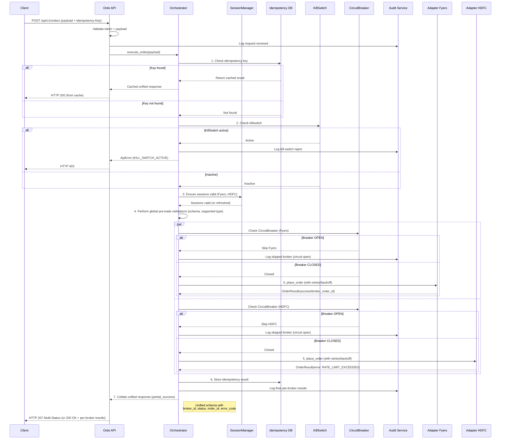

# Ordo Architecture Document (In Progress)

**Status:** v1.0 Final. This document represents the complete baseline architecture for the Ordo MVP.

---

## 1. Introduction

This document outlines the backend architecture for **Ordo**, an open-source, self-hostable backend designed for **algo developers and small trading desks**. It unifies broker integrations for the Indian market (MVP: Fyers, HDFC Securities, Mirae m.Stock) into a single, resilient API.

The primary architectural goal is to handle complex workflows—authentication, request orchestration, retries, and safe order placement—while remaining lightweight enough to run on a modest 1 vCPU + 1 GB RAM instance. This architecture prioritizes **developer ergonomics**, **operational readiness**, and **extensibility**.

**Architectural Boundary:** Ordo is intentionally a backend-first infrastructure layer. Any dashboard or UX built on top is a separate concern and **requires** its own Frontend Architecture document. This document focuses exclusively on backend services, persistence, security, and observability.

**Starter Template:** N/A — this is a greenfield backend service using Python, FastAPI, and Poetry.

---

## 2. High-Level Architecture

### 2.1. Technical Summary

Ordo is a lightweight, **modular monolithic** backend with clear component boundaries: a core **Orchestrator**, an **Adapter Layer**, an **Auth/Session Manager**, and services for **Persistence** and **Auditing**. It is built on an async Python stack (FastAPI, asyncio, httpx) for efficient fan-out concurrency and is optimized for small cloud instances (1 vCPU/1GB RAM).

The architecture favors pragmatic simplicity and progressive complexity. It starts as a single process with clear extension points to optionally evolve with external services like Redis (for caching) or PostgreSQL (for scaled persistence) as future needs dictate.

**Key Architectural Patterns:**
*   **Ports and Adapters (Hexagonal):** The core logic is isolated from external concerns. This is primarily implemented via the **Adapter Pattern** for the broker integration layer.
*   **Repository Pattern:** Decouples business logic from data storage, initially for file-based logs and later for optional database backends.
*   **Resilience Patterns:** Includes **Circuit Breaker**, **Retry**, and **Idempotency** patterns to ensure safe and reliable communication with external APIs.
*   **Observability:** Employs **Correlation IDs** for traceable logging across all system components.

This architecture directly supports the PRD goals by providing a secure, extensible, and reliable orchestration layer with clear operational controls (kill-switch, status), safety mechanisms (idempotency, audits), and a lightweight deployment model (Docker).

### 2.2. High-Level Overview

**Architecture Style**
*   **Primary Style:** Modular Monolith. This allows us to start small and fast while enforcing decoupling between internal components (e.g., orchestrator, adapters).
*   **Deployment:** A single Docker container per deployment. Optional external services like PostgreSQL and Redis are supported via configuration for users who need to scale.

**Repository & Service Structure**
*   **Repository:** A Monorepo will be used, with the single backend service located under `/src/ordo` (to be detailed in the Source Tree section).
*   **Service:** The service is a single-process FastAPI application. Its internal components are organized as distinct Python modules/packages (adapters, orchestrator, auth, persistence, audit, cli_tools).

**Primary Data & Request Flow (Conceptual)**
1.  A client calls the Ordo REST API (e.g., `/api/v1/orders`) with an `Authorization: Bearer <token>`.
2.  The API layer authenticates the request via the static token and validates the request payload against its schema.
3.  The **Orchestrator** receives the request and executes the core logic:
    *   Performs pre-trade validations (e.g., for funds, instrument tradability).
    *   Checks for an idempotency key to prevent duplicate write operations.
    *   Fans out requests concurrently to the chosen broker adapters using `asyncio` and `httpx`.
    *   Manages resilience patterns: retries (with exponential backoff) and circuit breakers.
    *   Collates results from all adapters.
4.  The **Audit/Logging** service records the request, all broker interactions, and the final outcome.
5.  A unified response is returned to the client, annotated per broker, with explicit handling for partial successes.
6.  **Background Tasks:** The application will manage recurring background tasks (like session token refreshes) using native `asyncio` background tasks.

**Key Architectural Decisions**
*   **Stack:** Python & FastAPI are chosen for high developer velocity, excellent performance in async I/O workloads, and strong community support.
*   **Architecture:** A Modular Monolith is chosen to minimize operational complexity at MVP while allowing for future evolution.
*   **Extensibility:** The `IBrokerAdapter` interface is the primary extension point for adding new brokers.
*   **Persistence:** **SQLite** is the default persistence layer for audit logs and idempotency keys. This provides robust, queryable storage without requiring an external database, perfectly aligning with the minimal footprint goal. PostgreSQL is supported as an optional, scalable backend.
*   **Scope Boundary:** The MVP is strictly for snapshot-based data (no WebSockets or real-time streaming).
*   **Security:** A "security-by-design" approach includes encryption for credentials at rest, TLS enforcement, a static bearer token for API access, and optional mTLS support.

### 2.3. High-Level Project Diagram

```mermaid
graph TD
    %% --- User Environment ---
    subgraph User's Environment
        Client["Client (Script / Dashboard)"]
        OTPScript["OTP Helper CLI"]
    end

    %% --- Ordo Service ---
    subgraph Ordo Service (Docker Container)
        OrdoAPI["Ordo API (FastAPI)"]
        
        Auth["Auth Middleware"]
        Orchestrator["Request Orchestrator"]
        
        subgraph Adapters
            AdapterInterface["IBrokerAdapter Interface"]
            Adapter1["Fyers Adapter"]
            Adapter2["HDFC Adapter"]
            Adapter3["Mirae Adapter"]
            MockAdapter["Mock Adapter"]

            SessionManager["Session Manager (per Adapter)"]
        end

        subgraph Persistence & State Stores
            DB["SQLite / Postgres"]
            IdempotencyStore["Idempotency Store (persistent)"]
            KillSwitchStore["Kill-Switch Store (persistent)"]
            SessionStore["Session Tokens (encrypted, persistent)"]
            AuditLog["Audit Log (JSON file and/or DB)"]
        end

        subgraph In-Memory State
            CircuitBreakerStore["Circuit Breaker State (ephemeral)"]
        end
    end

    %% --- External Services ---
    subgraph External Services
        BrokerAPIs["External Broker APIs"]
    end

    %% --- Primary Flows ---
    Client --> |API Requests (TLS)| OrdoAPI
    OTPScript --> |Initiates login & submits OTP via API| OrdoAPI

    OrdoAPI --> Auth
    Auth --> Orchestrator

    Orchestrator --> AdapterInterface
    AdapterInterface --> Adapter1
    AdapterInterface --> Adapter2
    AdapterInterface --> Adapter3
    AdapterInterface --> MockAdapter

    Adapter1 --> SessionManager
    Adapter2 --> SessionManager
    Adapter3 --> SessionManager

    Adapter1 --> |HTTPS| BrokerAPIs
    Adapter2 --> |HTTPS| BrokerAPIs
    Adapter3 --> |HTTPS| BrokerAPIs

    %% --- Internal Data Flows ---
    Orchestrator --> IdempotencyStore
    Orchestrator --> KillSwitchStore
    Orchestrator --> CircuitBreakerStore
    Orchestrator --> AuditLog
    SessionManager --> SessionStore
```

### 2.4. Architectural and Design Patterns

*   **Hexagonal Architecture (Ports & Adapters):** The core application logic is isolated from external concerns. This is primarily implemented via the `IBrokerAdapter` interface, which defines methods like `login`, `place_order`, and `get_portfolio`.
    *   *Rationale:* Decouples the core system from volatile external APIs, simplifies testing by allowing mock adapters, and enables community contributions for new brokers (NFR12).
*   **Repository Pattern:** Data persistence and access (for sessions, idempotency keys, etc.) will be handled through a repository layer that abstracts the underlying database (SQLite or Postgres).
    *   *Rationale:* Provides flexibility to swap database backends with minimal code changes and simplifies unit testing by allowing mock repositories (NFR5).
*   **Dependency Injection:** The application will leverage FastAPI's built-in DI container to provide services and repository implementations to the components that need them.
    *   *Rationale:* Promotes loose coupling, enhances testability by making it easy to inject mock dependencies, and manages the lifecycle of components.
*   **Resilience Patterns (Circuit Breaker & Retry):** Each adapter will be protected by its own circuit breaker. API calls will use a retry strategy with exponential backoff and jitter.
    *   *Rationale:* Prevents cascading failures from a single faulty broker and gracefully handles transient network or API errors, a core resilience requirement (FR10, FR18).
*   **Idempotency Pattern:** All write operations, especially order placement, will support an idempotency key that is checked against a persistent store.
    *   *Rationale:* Critical for safe trading operations, guaranteeing that retried requests do not result in duplicate orders (FR16).
*   **Immutable, Append-Only Logging:** Audit records will be treated as immutable events and written to a structured (JSON) log in an append-only fashion.
    *   *Rationale:* Ensures a tamper-resistant trail for traceability, debugging, and potential compliance needs (FR19).

---

## 3. Tech Stack

| Category | Technology | Version | Purpose | Rationale |
| :--- | :--- | :--- | :--- | :--- |
| **Language** | Python | 3.12 | Core application language | Modern, async-capable, strong community, and specified in PRD. |
| **Runtime** | Uvicorn | 0.36.0 | ASGI server | High-performance server required to run FastAPI. |
| **Framework** | FastAPI | 0.117.1 | Backend web framework | High performance, built-in data validation, and dependency injection. |
| **Dependency Mgmt** | Poetry | 2.2.1 | Dependency management & packaging | Manages dependencies, virtual envs, and packaging; specified in PRD. |
| **HTTP Client** | HTTPX | 0.28.1 | Asynchronous HTTP requests | Required for performing non-blocking, concurrent fan-out requests to brokers. |
| **Default Database** | SQLite | 3.38+ | Default persistence layer | File-based, no external service needed, perfect for minimal footprint goal. |
| **Optional Database** | PostgreSQL | 15+ | Optional scalable persistence | Robust, open-source SQL database for users needing to scale. |
| **ORM / Persistence Toolkit** | SQLModel | 0.0.8+ | Async ORM + Pydantic-based models | Unifies SQLAlchemy and Pydantic, async support, simplifies repo pattern. |
| **Optional Cache** | Redis | 7.0+ | Optional caching layer | Industry standard for caching and can be used for kill-switch/state stores. |
| **Crypto / Security** | cryptography | 41.0+ | Encrypt sensitive secrets and tokens at rest | Battle-tested Python crypto library; needed for session token encryption. |
| **Linting** | Ruff | 0.1+ | Code linting | Extremely fast linter, ensures code quality and consistency; specified in PRD. |
| **Formatting** | Black | 23.9+ | Code formatting | Enforces a consistent, non-negotiable code style; specified in PRD. |
| **Testing** | Pytest | 7.4+ | Test framework | Standard for Python testing; enables clear, scalable tests for all components. |
| **Testing Utilities** | respx, pytest-asyncio, pytest-cov | latest | Mocking, async testing, coverage | Enable robust async HTTP testing and coverage metrics. |
| **Logging** | structlog | 23.1+ | Structured JSON logging | Provides machine-readable logs for observability and audit requirements. |
| **Metrics / Monitoring** | Prometheus FastAPI Instrumentator | 6.0+ | Metrics collection | Lightweight instrumentation for Prometheus-compatible monitoring. |
| **CLI Framework** | Typer | 0.9+ | CLI for helper scripts (e.g., OTP) | Consistent with FastAPI/SQLModel, provides modern CLI experience. |
| **Containerization** | Docker | 24.0+ | Container runtime | Packages the application and its dependencies for portable deployment. |
| **Local Orchestration** | Docker Compose | 2.20+ | Local orchestration of multi-service setup | Allows developers to spin up Ordo with Postgres/Redis easily. |
| **CI/CD** | GitHub Actions | hosted | Continuous Integration and Delivery | Runs linting, tests, build, and publishing pipelines; automates Docker Hub and PyPI publishing. |
| **DB Migrations** | Alembic | 1.12+ | **Post-MVP:** Database schema migrations | Standard tool for SQLAlchemy/SQLModel for managing schema evolution. |

---

## 4. Data Model Strategy

### Definitive Data Architecture Strategy (v4)

#### Part 1: Guiding Principles

1.  **Source of Truth:** The broker is the single source of truth for real-time data like portfolios and positions. The Ordo database **does not** persist this data, preventing staleness.
2.  **Standardization over Pass-Through:** The primary goal of the API models (DTOs) is to unify broker-specific data and error codes into a single, standard schema. This simplifies client-side logic.
3.  **Naming Convention:** All database-persisted models will be prefixed with `Db` (e.g., `DbSession`). All API and configuration models (Pydantic schemas) will reside in a dedicated `/schemas` directory.
4.  **API Versioning:** All API DTOs are considered part of the `v1` API contract. Any future breaking changes to a model will require a new API version.
5.  **Progressive Complexity:** The default persistence and state management will use the simplest, most lightweight options (in-memory, SQLite). More complex options (Redis, Postgres, DB-based circuit breakers) are available for users who need to scale.

#### Part 2: Model Definitions

**A. Persistent Models (`Db*`)**

*   **`DbSession`**
    *   **Purpose:** Persists a single account's session with a single broker.
    *   **Primary Key:** Composite key of (`adapter_id`, `account_id`).
    *   **Attributes:** `access_token_encrypted`, `refresh_token_encrypted` (optional), `expires_at`, `metadata_json` (for other broker-specific fields).
*   **`DbIdempotencyRecord`**
    *   **Purpose:** Prevents duplicate write operations.
    *   **Attributes:** `key` (primary key), `response_snapshot_json`, `expires_at` (to enable TTL/cleanup).
*   **`DbCircuitBreakerState` (Optional)**
    *   **Purpose:** Optional persistence for circuit breaker state to survive restarts. The default is in-memory.
    *   **Attributes:** `adapter_id`, `state` (Enum: OPEN, HALF_OPEN, CLOSED), `failure_count`, `last_failure_at`.

**B. In-Memory / API Models (Pydantic Schemas)**

*   **`Portfolio`**
    *   **Purpose:** A unified summary of a user's account.
    *   **Attributes:** `cash_balance`, `margin_available`, `positions` (list[`Position`]), `holdings` (list[`Holding`]), `metadata_json` (optional escape hatch for broker-specific data).
*   **`Position` & `Holding`**: Separate DTOs representing daily and long-term holdings, respectively.
*   **`Quote`**
    *   **Purpose:** A minimal, standardized market data quote.
    *   **Attributes:** `instrument_token`, `last_price`, `timestamp`, `extended_fields_json` (optional).
*   **`ApiError`**
    *   **Purpose:** The standard structure for all error responses.
    *   **Attributes:** `error_code` (standardized Enum), `message` (human-readable), `details` ({`broker_id`: `fyers`, `native_error`: `...`}), `correlation_id`.

**C. Configuration Models (Pydantic Settings)**

*   **`BrokerConfig` (Base Class)**: An abstract base class for all broker configurations.
*   **`FyersConfig(BrokerConfig)` / `HDFCConfig(BrokerConfig)`**: Concrete, type-safe subclasses for each broker, defining the specific fields they require (e.g., `client_id`, `secret_key`).

#### Part 3: Specific Strategies

*   **Portfolio Caching Strategy:** Portfolio data is fetched on demand from the broker and **is not persisted** in the Ordo database. An optional, short-lived (e.g., 1-5 seconds, configurable) in-memory or Redis cache can be enabled to reduce latency for high-frequency polling clients.
*   **Audit Strategy:** Auditing will be performed via structured, append-only JSON logs written to a file (`structlog`), which satisfies the MVP requirement. A `DbAuditLogEntry` table is out of scope for MVP but can be added later if required for advanced querying or compliance.
*   **Error Code Strategy:** Error codes returned in the `ApiError` model will be **standardized** across all brokers (e.g., `INSUFFICIENT_FUNDS`, `INVALID_SESSION`). The original broker-native error message will be available in the `details` field for debugging.

---

## 5. Components

### 5.1. Request Orchestrator — Specification

**Purpose:** The central brain that accepts validated API requests and executes end-to-end business logic (fan-out to brokers, resilience, idempotency, collation, auditing) while keeping responsibilities bounded and testable.

**1. High-level responsibilities (summary)**
*   Check global safety gates (kill-switch, authorization context).
*   Handle idempotency for write operations (orders).
*   Perform pre-trade validation (instrument, margin/funds) before any broker calls.
*   Fan out requests concurrently to selected broker adapters.
*   Enforce per-broker timeouts, per-call retries with exponential backoff + jitter, and circuit breaker checks.
*   Collate per-broker results into a UnifiedResponse that captures overall status and per-broker detail.
*   Emit audit events at well-defined lifecycle points.
*   Delegate session/login flows to SessionManager (not handle low-level OTP logic itself).
*   Expose an interface testable in isolation from adapters (dependency injection/mocks).

**2. Key design principles**
*   Small surface area: Orchestrator coordinates, it does not implement broker logic (adapters do).
*   Deterministic outcomes: Idempotency & clear error codes so clients and automation can react reliably.
*   Fail-fast safety: Check kill-switch and pre-trade validations early to avoid unnecessary side-effects.
*   Observable: Correlation IDs, structured audit points, and metrics for latency/ success rates.
*   Configurable resilience: Per-adapter timeout, retry, and circuit breaker config.
*   Testable: All external dependencies injected, with strong unit/integration test coverage using HTTPX/respx mocks.

**3. API / Public Interfaces (types)**
*   Use Pydantic DTOs for request/response shapes.
  *   `execute_order(order: OrderRequest, brokers: list[str], context: RequestContext) -> UnifiedResponse`
  *   `get_portfolio(accounts: list[Account], context: RequestContext) -> UnifiedResponse`
  *   `initiate_login(account: Account) -> LoginInitiationResult` (delegates to SessionManager)
  *   `submit_otp(account: Account, otp: str) -> SessionStatus` (delegates to SessionManager)

**UnifiedResponse (Pydantic)**
```python
class BrokerResult(BaseModel):
    broker_id: str
    status: Literal["success","failed","pending"]
    code: Optional[str]  # standardized error code e.g., INSUFFICIENT_FUNDS
    message: Optional[str]
    payload: Optional[dict]  # broker-specific details (order id, etc.)
    latency_ms: Optional[int]

class UnifiedResponse(BaseModel):
    overall_status: Literal["success","partial_success","failure"]
    results: List[BrokerResult]      # one entry per targeted broker
    correlation_id: str
    elapsed_ms: int
    errors: Optional[List[ApiError]] # aggregated errors if any
```

**4. Execution flow (detailed, step-by-step)**
*   Receive request with validated OrderRequest and RequestContext (includes correlation id, authenticated principal).
*   Check Kill-Switch (persistent store or in-memory): if active, return `overall_status: failure` with `error_code: KILL_SWITCH_ACTIVE`.
*   Idempotency check (for write ops):
    *   If `Idempotency-Key` header present, consult `DbIdempotencyRecord`.
    *   If found and within TTL → return cached `UnifiedResponse`.
    *   Else reserve key (atomic insert) and continue.
*   Pre-trade validation (orders only): instrument existence/tradability + margin/funds check per account. If validation fails → return fast rejection (no broker calls).
*   Compute target adapter list based on `brokers` parameter and adapters' session status. Skip adapters that are offline/unavailable (annotate result as failed with code `ADAPTER_UNAVAILABLE`).
*   Per-broker operation pipeline (executed concurrently, but each adapter call follows this pattern):
    a. Check circuit breaker state; if OPEN → short-circuit to failed `BrokerResult` code `CB_OPEN`.
    b. Perform call with per-broker timeout (configurable). Use `httpx` with timeout.
    c. Retries: use exponential backoff + jitter for retriable error codes (e.g., 429, 5xx). Limit retries per broker (configurable).
    d. Collect broker response; map to `BrokerResult` with normalized code/message and latency.
*   Collation: gather all `BrokerResult` objects. Compute `overall_status`:
    *   `success` = all success;
    *   `partial_success` = at least one success and at least one failure;
    *   `failure` = all failed.
*   Persistence: store idempotency record (with `UnifiedResponse` snapshot) before returning to client (ensure durable response for retries).
*   Audit: emit audit events for Request Received, Pre-trade validation result, Broker Calls (start/finish per broker), Final Result. These must include correlation id and truncated payloads (no secrets).
*   Return `UnifiedResponse` with HTTP status codes: 200 for success, 207 for partial success (recommended), 400/4xx/503 for final failure depending on cause.

**5. Resilience & retry semantics (concrete)**
*   Per-broker timeout default: 8s (configurable).
*   Retry policy default: 3 attempts max, exponential backoff base 0.5s, multiplier 2, jitter 0.1–0.5s. Retries apply to network timeouts, 5xx, 429.
*   Circuit breaker per adapter: open after N failures in M seconds (e.g., 5 failures in 60s). Half-open probe allowed after T seconds. Configurable thresholds. Circuit breaker state stored in memory and optionally backed by Redis for multi-instance.
*   Backpressure / rate limiting: enforce per-adapter concurrency limits (Semaphore) and per-adapter rate limiters (token bucket). Configurable in adapter config.

**6. Idempotency details**
*   Key source: client `Idempotency-Key` header (required for clients that want dedup guarantee).
*   Store: `DbIdempotencyRecord` persisted with `response_snapshot_json` and `expires_at`.
*   Atomic reservation: use DB unique constraint to avoid race conditions (insert only if not exists).
*   TTL: default 24 hours (configurable). Cleanup job to prune expired keys.
*   Behavior: If same key seen after expiration → treated as new request.

**7. Pre-trade validation rules (minimum for MVP)**
*   Verify instrument exists and is tradable on the broker (use adapter metadata).
*   Verify account has sufficient cash/margin (query adapter session or session cache). For multi-broker orders, ensure the specific account for that broker has required resources (if order targets specific accounts).
*   Return clear, standardized error codes: `INVALID_INSTRUMENT`, `INSUFFICIENT_FUNDS`, `BROKER_NOT_AUTHENTICATED`.

**8. Audit & observability (hook points)**
*   Emit audit entries at these points (include `correlation_id`, `actor`, brief payload, and non-sensitive metadata):
    *   `request.received` (incoming payload)
    *   `request.pretrade.validated` (pass/fail + reason)
    *   `broker.call.started` (broker_id, attempt_no)
    *   `broker.call.finished` (broker_id, status, latency_ms, mapped_code)
    *   `request.result` (final `UnifiedResponse`)
*   Metrics to emit (Prometheus): per-api latency histogram, per-broker success rate, retry counts, circuit breaker trips, idempotency cache hit rate.

**9. Error mapping & codes**
*   Use standardized error codes across Ordo (not raw broker strings): e.g., `INVALID_OTP`, `RATE_LIMIT`, `TIMEOUT`, `CB_OPEN`, `INSUFFICIENT_FUNDS`, `KILL_SWITCH_ACTIVE`.
*   Include `broker_raw_code` inside `BrokerResult.payload` for diagnostics.
*   All API errors must contain `correlation_id` so clients can share when reporting incidents.

**10. Security considerations**
*   Never log secrets or full tokens — redact in audit payloads.
*   All outbound calls use TLS and configured per-adapter client certificates if present.
*   Ensure persisted idempotency response snapshots do not include secrets.
*   Time sync: validate host clock at startup; warn if drift > threshold (some broker APIs require synced timestamp).

**11. Concurrency & performance guidance**
*   Use `asyncio.gather` with `return_exceptions=False` and per-task timeout wrappers.
*   Use per-adapter semaphores for concurrency control to avoid runaway parallelism on limited instances (1 vCPU/1GB). Example: limit to 4 concurrent calls per adapter by default.
*   Keep bridge overhead minimal: measuring only orchestration cost (exclude broker RTT) — aim for median orchestration overhead ≤50ms (NFR1). Instrument and optimize hot paths if approaching limits.
*   For heavy fan-out across many brokers, ensure orchestrator imposes a global response SLA (e.g., overall timeout of 12s) to keep caller experience bounded.

**12. Testing strategy (for orchestrator)**
*   Unit tests:
    *   Mock adapters with deterministic behaviors (success, transient 5xx, non-retriable 4xx).
    *   Test idempotency behavior (reserve + cached response).
    *   Test kill-switch behavior (reject early).
*   Integration tests:
    *   Use `respx` to mock HTTP responses from adapters.
    *   Validate backoff/retry counts and circuit breaker transitions.
*   Load tests (optional):
    *   Simulate N parallel `execute_order` requests to validate semaphores and orchestration latency.
*   Acceptance: Add tests asserting `UnifiedResponse` mapping and error code normalization.

**13. Configuration knobs (example)**
*   `orchestrator.global_timeout_ms = 12000`
*   `adapter.<broker>.timeout_s = 8`
*   `adapter.<broker>.retries = 3`
*   `adapter.<broker>.concurrency = 4`
*   `idempotency.ttl_hours = 24`
*   `circuit_breaker.failure_threshold = 5`
*   `circuit_breaker.window_seconds = 60`
*   `circuit_breaker.reset_seconds = 120`
*   All config surfaced via Pydantic Settings and overridable by ENV/YAML.

**14. Minimal pseudocode**
```python
async def execute_order(order, brokers, context):
    correlation_id = context.correlation_id
    start = now()
    if killswitch.is_active():
        return UnifiedResponse(... overall_status="failure", errors=[KILL_SWITCH_ACTIVE])

    if order.has_idempotency_key():
        cached = db.get_idempotency(order.idempotency_key)
        if cached:
            return cached.response

    valid, reason = pretrade_validator.validate(order)
    if not valid:
        return UnifiedResponse(... overall_status="failure", errors=[reason])

    # select and filter adapters
    adapters = [registry.get(b) for b in brokers if registry.is_available(b)]

    # fan-out
    tasks = [run_for_adapter(adapter, order, correlation_id) for adapter in adapters]
    results = await asyncio.gather(*tasks, return_exceptions=False)  # per adapter handles its own timeout/retries

    unified = collate_results(results, correlation_id, elapsed_ms=elapsed(start))
    if order.has_idempotency_key():
        db.store_idempotency(order.idempotency_key, unified, ttl=config.idempotency_ttl)

    audit.emit("request.result", unified)
    return unified
```
`run_for_adapter` wraps circuit breaker checks, per-adapter semaphore, retry with tenacity or custom backoff, and maps broker response to `BrokerResult`.

**15. Extensibility & separation of concerns**
*   SessionManager: handles login/OTP flows and session persistence; orchestrator calls it to check adapter authentication status.
*   Adapter contract: adapters only implement `place_order`, `get_portfolio`, etc., and map broker responses into standard `OrderResult`.
*   Orchestrator remains thin coordinator — easy to move into a separate process if load demands in future.

**16. Acceptance criteria (short)**
*   Orchestrator returns `UnifiedResponse` for representative order with one successful adapter and one transient failure → `overall_status = "partial_success"`.
*   Idempotency key reused within TTL returns cached response (no broker calls).
*   Kill-switch active leads to immediate `KILL_SWITCH_ACTIVE` error without any broker calls.
*   Circuit breaker trips after configured failures and causes short-circuit responses.
*   Audit events emitted at all lifecycle hooks listed.

---

### 5.2. Broker Adapter Interface (IBrokerAdapter)

**1. Purpose & Core Principles**

The `IBrokerAdapter` defines the contract that all broker-specific implementations must follow. It abstracts away broker quirks and provides Ordo with a consistent, reliable interface for trading operations, portfolio data, and session management.

*   **Abstraction** — Each adapter encapsulates broker-specific endpoints, request/response formats, and quirks.
*   **Standardization** — Adapters translate raw broker data into Ordo’s standardized Pydantic DTOs (Portfolio, OrderResult, ApiError).
*   **Isolation** — Adapters are independent. They do not know about the Orchestrator, SessionManager, or other adapters.
*   **Consistency** — Every adapter behaves predictably across login, portfolio fetch, and order placement.

**2. Interface Definition (Python `abc`)**
```python
from abc import ABC, abstractmethod
from typing import Optional
from schemas import (
    OrderRequest,
    OrderResult,
    Portfolio,
    SessionStatus,
    LoginInitiationResult,
    ApiError,
)
from config import BrokerConfig


class IBrokerAdapter(ABC):
    """
    Formal contract for all broker adapters.
    """

    def __init__(self, config: BrokerConfig):
        """
        Initialize adapter with validated configuration.
        Each adapter instance is typically bound to a single account.
        """
        self.config = config

    @property @abstractmethod
    def broker_id(self) -> str:
        """Unique slug for the broker (e.g., 'fyers', 'hdfc_sec')."""

    # --- Trading Operations ---
    @abstractmethod
    async def place_order(self, order: OrderRequest, context: dict) -> OrderResult:
        """
        Place an order with the broker.
        Must map Ordo order fields (e.g., symbol, type, side) to broker-specific API fields.
        Should raise BrokerError on unrecoverable failures.
        """

    # --- Portfolio & Data ---
    @abstractmethod
    async def get_portfolio(self, context: dict) -> Portfolio:
        """
        Retrieve the user's full portfolio (positions, holdings, balances).
        Should map broker-specific response into Ordo's standardized Portfolio DTO.
        """

    # --- Session Lifecycle ---
    @abstractmethod
    async def initiate_login(self) -> LoginInitiationResult:
        """
        Start the broker’s login flow (e.g., generate login URL, OTP request).
        Typically called by SessionManager.
        """

    @abstractmethod
    async def complete_login(self, auth_code: str) -> SessionStatus:
        """
        Complete login with OTP or auth code.
        Should return a standardized SessionStatus object containing access token
        and expiry information.
        """

    async def refresh_session(self) -> Optional[SessionStatus]:
        """
        (Optional) Refresh session using a refresh token.
        Default implementation raises NotImplementedError if broker does not support it.
        """
        raise NotImplementedError("This broker does not support refresh_session")

    @abstractmethod
    async def get_session_status(self) -> SessionStatus:
        """
        Return whether the current session is valid.
        Must detect expired or invalidated sessions.
        """
```

**3. Error Handling Strategy**

*   All adapter methods must raise `BrokerError` (a common Ordo exception) on unrecoverable failures.
*   Transient errors (timeouts, rate limits) should be raised with specific error codes so the Orchestrator can retry.
*   `ApiError` mapping: Adapters map broker error codes → Ordo’s standardized `ApiError` schema for consistency.

**4. Responsibilities of an Adapter Implementer**

When creating a new adapter (e.g., `ZerodhaAdapter`), the implementer must:
*   **Subclass `BrokerConfig`**: Define required credentials and broker-specific config.
*   **Implement `IBrokerAdapter`**: Provide working methods for login, portfolio, and order placement.
*   **Handle Authentication**: Correctly implement `initiate_login` / `complete_login`. Implement `refresh_session` only if supported.
*   **Map Data Models**: Translate broker responses → `Portfolio`, `OrderResult`.
*   **Map Errors**: Translate broker-specific HTTP and error codes → Ordo `ApiError`.
*   **Testing**: Provide unit tests using `respx` to mock broker APIs. Adapters must pass Ordo’s shared adapter contract test suite.

**5. Account Scoping**

*   Each adapter instance is typically bound to one broker account.
*   If a broker supports multi-account management, the adapter may internally multiplex, but this must be explicitly documented.

---

### 5.3. Session Manager

**1. Purpose and Core Responsibilities**

The Session Manager is the sole authority within Ordo for managing the lifecycle of broker authentication sessions.
*   **State Management** — Owns all reads/writes to `DbSession`.
*   **Flow Orchestration** — Drives login/refresh flows by invoking adapter methods (`initiate_login`, `complete_login`, `refresh_session`).
*   **Security** — Ensures tokens are encrypted at rest, decrypted only when required.
*   **Validation** — Provides a unified interface to check if a session is valid before broker calls.
*   **Concurrency Safety** — Ensures that refresh operations are not duplicated across concurrent requests.

**2. Key Design Principles**
*   **Encapsulation** — Other components never see raw tokens or persistence details.
*   **Coordination, Not Implementation** — Session Manager orchestrates flows; adapters implement broker specifics.
*   **Centralization** — Avoids scattered login/refresh logic.
*   **Resilience** — Handles session expiry gracefully and retries intelligently.
*   **Least Privilege** — Tokens decrypted only just-in-time for adapter use.

**3. Public Interface**
```python
from typing import Optional
from schemas import LoginInitiationResult, SessionStatus, SessionCheckResult

class SessionManager:
    """
    Manages the lifecycle of broker authentication sessions.
    """

    def __init__(self, repository: SessionRepository, crypto: CryptoService, adapter_registry: AdapterRegistry):
        self.repository = repository
        self.crypto = crypto
        self.adapter_registry = adapter_registry
        self._locks = {}  # concurrency control per (broker_id, account_id)

    async def initiate_login(self, account_id: str, broker_id: str) -> LoginInitiationResult:
        """
        Start the login flow for a given account by calling the adapter’s initiate_login().
        """
        ...

    async def complete_login(self, account_id: str, broker_id: str, auth_code: str) -> SessionStatus:
        """
        Complete the login flow, encrypt new tokens, and persist session.
        """
        ...

    async def ensure_valid_session(self, account_id: str, broker_id: str) -> SessionCheckResult:
        """
        High-level check for orchestrator:
          1. Retrieve persisted session.
          2. If expired, attempt refresh (with concurrency-safe lock).
          3. Return a SessionCheckResult with status and reason.
        """
        ...

    async def get_session_status(self, account_id: str, broker_id: str) -> SessionStatus:
        """
        Retrieve persisted session status for an account.
        """
        ...

    async def _get_decrypted_token(self, account_id: str, broker_id: str) -> str:
        """
        Internal: Retrieve and decrypt token for adapter use.
        Not intended for external calls; orchestrator should always use ensure_valid_session first.
        """
        ...
```

**4. Supporting Types**
```python
class SessionCheckResult(BaseModel):
    status: str  # "valid", "expired", "refresh_failed", "unsupported"
    reason: Optional[str] = None
    session_status: Optional[SessionStatus] = None
```
This makes Orchestrator decisions explicit:
*   `valid` → safe to proceed
*   `expired` / `refresh_failed` → fail fast or bubble up error
*   `unsupported` → only manual re-login possible

**5. High-Level Execution Flows**
*   **A. Initial Login Flow**
    *   API route `/api/v1/auth/{broker}/{account}/login` → `SessionManager.initiate_login`.
    *   Session Manager fetches adapter, calls `adapter.initiate_login()`.
    *   Returns a `LoginInitiationResult` (e.g., login URL).
    *   After OTP/auth, client calls `/api/v1/auth/callback`.
    *   API route → `SessionManager.complete_login(auth_code)`.
    *   Adapter returns tokens → encrypted → persisted as `DbSession`.
*   **B. Reactive Refresh Flow**
    *   Orchestrator → `ensure_valid_session`.
    *   If token valid → return `SessionCheckResult(status="valid")`.
    *   If expired → acquire lock for (`broker_id`, `account_id`).
    *   Call `adapter.refresh_session()`.
        *   If success → encrypt/persist → return `SessionCheckResult(status="valid")`.
        *   If not supported → return `SessionCheckResult(status="unsupported")`.
        *   If failed → return `SessionCheckResult(status="refresh_failed", reason=...)`.

**6. Error Handling Strategy**
*   Explicit Result Objects instead of `bool` → more diagnosable.
*   Transient vs unrecoverable errors bubble up via `SessionCheckResult.reason`.
*   Locking ensures refresh only happens once per account/broker at a time.

**7. Testing Expectations**
*   Unit tests must cover:
    *   Initial login flow success/failure.
    *   Expired token → refresh success.
    *   Expired token → refresh failure.
    *   Expired token → broker does not support refresh.
    *   Concurrency test → two refresh calls result in a single refresh attempt.

---

### Persistence Component — Final Specification

**1. Purpose and Core Responsibilities**

The Persistence Service implements the Repository Pattern, creating an abstraction layer between Ordo’s business logic and the underlying database (SQLite for default, PostgreSQL for scale).

*   **Responsibilities:**
    *   Decouple business logic from DB dialect (SQLite/Postgres).
    *   Provide a uniform contract for CRUD operations on session, idempotency, audit, and kill-switch data.
    *   Ensure encrypted-at-rest token storage.
    *   Support easy mocking for unit testing.

**2. Core Design & Implementation**

*   **ORM/Library:** `SQLModel` (Pydantic + SQLAlchemy) for schema + ORM.
*   **Async-first:** All repository methods are `async`.
*   **DI-friendly:** Repositories provided via FastAPI dependency injection.
*   **Security Boundary:** Repositories only ever persist encrypted tokens. Encryption/decryption happens at the `SessionManager` layer, not here.

**3. Repository Interfaces (ABC)**

All repository interfaces are defined as abstract base classes (ABCs).

**`ISessionRepository`**
```python
class ISessionRepository(ABC):
    """
    Interface for storing and retrieving broker sessions.
    Tokens passed to persistence are always encrypted.
    """
    @abstractmethod
    async def get_session(self, broker_id: str, account_id: str) -> Optional[DbSession]: ...
    @abstractmethod
    async def save_session(self, session: DbSession) -> DbSession: ...
    @abstractmethod
    async def delete_session(self, broker_id: str, account_id: str) -> None: ...
```

**`IIdempotencyRepository`**
```python
class IIdempotencyRepository(ABC):
    """ Interface for idempotency records. """
    @abstractmethod
    async def get_record(self, key: str) -> Optional[DbIdempotencyRecord]: ...
    @abstractmethod
    async def create_record(self, record: DbIdempotencyRecord) -> DbIdempotencyRecord:
        """ Must raise IntegrityError if key already exists. Handled at service layer. """
        ...
```

**`IAuditLogRepository`**
```python
class IAuditLogRepository(ABC):
    """
    Interface for optional audit log persistence to a database.
    The application supports both 'file' and 'database' audit backends,
    configurable at runtime. 'file' is the default for MVP.
    """
    @abstractmethod
    async def save_entry(self, entry: DbAuditLogEntry) -> DbAuditLogEntry: ...
```

**`IKillSwitchRepository`**
```python
class IKillSwitchRepository(ABC):
    """ Interface for kill-switch persistence. """
    @abstractmethod
    async def get_state(self) -> bool: ...
    @abstractmethod
    async def set_state(self, enabled: bool) -> None: ...
```

**3.1. Supporting Data Models**

While most data models are defined in the global Data Model Strategy, the `KillSwitch` is a simple state managed here.

```python
from sqlmodel import SQLModel, Field

class DbKillSwitch(SQLModel, table=True):
    """ A simple model to hold the global kill-switch state. """
    id: Optional[int] = Field(default=1, primary_key=True)
    is_active: bool = Field(default=False)
```

**4. Concrete Implementations (SQLite Default)**

The `SqliteKillSwitchRepository` will operate on the `DbKillSwitch` model, typically on the single row where `id=1`. Other repos (SqliteSessionRepository, SqliteIdempotencyRepository, etc.) follow the patterns previously discussed.

**Example: `SqliteSessionRepository`**
```python
class SqliteSessionRepository(ISessionRepository):
    def __init__(self, session: AsyncSession):
        self.session = session

    async def get_session(self, broker_id: str, account_id: str) -> Optional[DbSession]:
        statement = select(DbSession).where(DbSession.broker_id == broker_id, DbSession.account_id == account_id)
        result = await self.session.exec(statement)
        return result.one_or_none()

    async def save_session(self, session: DbSession) -> DbSession:
        self.session.add(session)
        await self.session.commit()
        await self.session.refresh(session)
        return session

    async def delete_session(self, broker_id: str, account_id: str) -> None:
        db_session = await self.get_session(broker_id, account_id)
        if db_session:
            await self.session.delete(db_session)
            await self.session.commit()
```

**5. Database Engine & Session Management**

*   The `DATABASE_URL` will be loaded from the application's configuration (e.g., environment variables) to allow easy switching between SQLite and PostgreSQL.
*   A single `AsyncEngine` is created at startup.
*   A new `AsyncSession` is provided per-request via a FastAPI dependency.

```python
# In database.py
from sqlmodel import create_async_engine
from sqlmodel.ext.asyncio.session import AsyncSession
from collections.abc import AsyncGenerator
from app.config import settings # Example of loading config

# The DATABASE_URL is loaded from configuration
engine = create_async_engine(settings.DATABASE_URL, echo=False)

async def get_session() -> AsyncGenerator[AsyncSession, None]:
    async with AsyncSession(engine) as session:
        yield session
```

**6. Migration & Schema Evolution**

*   **SQLite (MVP):** For simplicity, MVP assumes dropping/rebuilding the schema if models change.
*   **Postgres (scale-up):** Future migration support via Alembic is expected.

**7. Concurrency & Transactionality**

*   Idempotency records must rely on DB uniqueness constraints (`key UNIQUE`).
*   Session writes must use transactions to avoid race conditions.
*   The `SqliteKillSwitchRepository` will use a transaction to ensure atomic updates to the state.

**8. Testing Strategy**

*   Provide in-memory repositories (e.g., `InMemorySessionRepository`) for fast unit tests.
*   Integration tests will cover both SQLite and (optionally) Postgres backends.
*   Contract tests will ensure all repository implementations satisfy their ABCs.

---

### 5.5. Other System Components — Final Specification

This section defines the remaining high-level components that support the core application logic.

#### **1) API Server (FastAPI) — Refined Spec**

**1. Responsibility (concise)**
*   1.1. Expose versioned REST endpoints (`/api/v1/*`) implementing the Ordo contract.
*   1.2. Validate input with Pydantic DTOs and enforce the standardized `ApiError` response schema on all errors.
*   1.3. Inject security context (via Auth Middleware) and `correlation_id` into each request.
*   1.4. Route validated requests to the service layer (Orchestrator, SessionManager).
*   1.5. Provide size limits, request rate limits, and response time SLAs.

**2. Key Endpoints (initial)**
*   2.1. `GET /health`: An unauthenticated liveness probe that returns a simple HTTP 200 OK if the server is running.
*   2.2. `GET /api/v1/status`: An authenticated readiness probe that provides detailed system health, including adapter connectivity status.
*   2.3. `GET /api/v1/portfolio`: Unified portfolio (query param `brokers=` optional).
*   2.4. `POST /api/v1/orders`: Place orders; accepts `Idempotency-Key` header.
*   2.5. `POST /api/v1/killswitch`: Admin toggle (auth required).
*   2.6. `POST /api/v1/auth/{broker}/{account}/login` and callback endpoints for login flows.
*   2.7. `POST /api/v1/auth/report` (Optional): Receives and logs the final summary report from the OTP Helper CLI for audit purposes.

**3. Error contract (mandatory)**
*   3.1. All errors must serialize to `ApiError` JSON: `{"error_code": "STRING", "message": "Human friendly", "details": {...}, "correlation_id": "UUID"}`
*   3.2. Use consistent canonical codes (e.g., `INVALID_REQUEST`, `KILL_SWITCH_ACTIVE`, `IDEMPOTENCY_VIOLATION`, `INVALID_SESSION`, `RATE_LIMIT`, `TIMEOUT`, `PARTIAL_SUCCESS`).

**4. Rate limiting & size limits**
*   4.1. Per-instance config: `API_MAX_REQ_SIZE_BYTES` (default 256KB).
*   4.2. Lightweight token-bucket rate limiter per client token/IP (e.g., 60 req/min by default).
*   4.3. Reject with `ApiError` code `RATE_LIMIT` and HTTP 429 when exceeded.

**5. Timeouts & SLAs**
*   5.1. API-level global timeout: `ORCHESTRATOR_GLOBAL_TIMEOUT_MS` (default 12000ms).
*   5.2. For long-running operations, asynchronous job endpoints are noted as a post-MVP feature.

**6. Observability & Metrics**
*   6.1. Emit Prometheus metrics: `http_requests_total{endpoint,method,status}`, `http_request_duration_seconds` histogram per endpoint.
*   6.2. Correlate logs and metrics via `correlation_id`.

**7. Security & Best Practices**
*   7.1. Force TLS in deployment.
*   7.2. Validate and sanitize all inputs via Pydantic.
*   7.3. Enforce CORS disabled by default.
*   7.4. Do not leak internal stack traces in responses.

---

#### **2) Auth Middleware — Refined Spec**

**1. Responsibility (concise)**
*   1.1. Validate `Authorization: Bearer <token>` header.
*   1.2. Populate `request.state` with `security_context` and `correlation_id`.
*   1.3. Emit auth success/failure metrics.
*   1.4. Support live token reload without restart.

**2. MVP Behavior**
*   2.1. Default: single static bearer token `ORDO_API_TOKEN`.
*   2.2. Support token reload (e.g., via a secured admin endpoint like `/admin/reload-config` protected by a separate admin-only token).

**3. Rate-limiting & brute-force defense**
*   3.1. Track failed auth attempts per token/IP and enforce short-term throttling.
*   3.2. Emit metric `auth_failed_total{reason,client}`.

**4. Correlation ID**
*   4.1. If client provides `X-Correlation-ID`, propagate it; else generate UUIDv4.
*   4.2. Attach `correlation_id` to all logs/metrics for the request.

**5. Observability**
*   5.1. Emit metrics for successful and failed auth events.
*   5.2. Log attempts at INFO (success) and WARN (failure).

---

#### **3) Audit & Logging — Refined Spec**

**1. Responsibility (concise)**
*   1.1. Emit structured JSON logs for all important lifecycle events.
*   1.2. Provide optional persistence of audit logs to DB via `IAuditLogRepository`. Default is append-only JSON files with rotation.
*   1.3. Ensure PII and secrets are never persisted or emitted in logs.

**2. Log content & schema**
*   2.1. Each entry must include: `timestamp`, `level`, `service`, `component`, `correlation_id`, `actor`, `action`, `payload` (truncated & redacted), `outcome`.

**3. PII & secret handling**
*   3.1. Enforce a redaction policy: tokens, API keys, etc., must be replaced with `[REDACTED]`.
*   3.2. Implement a centralized `redact()` utility.

**4. Log sinks & rotation**
*   4.1. File-based default with size/time rotation.
*   4.2. Optional sinks (Loki, ELK) configurable via environment variables.

**5. Audit DB (optional)**
*   5.1. If DB persistence is enabled, write asynchronously to avoid blocking.
*   5.2. Requires a configurable retention policy.

**6. Observability hooks**
*   6.1. Emit metrics for key audit outcomes: `orders_placed_total`, `sessions_refreshed_total`, etc.

---

#### **4) OTP Helper CLI — Refined Spec**

**1. Purpose & modes**
*   1.1. A thin CLI to assist daily login flows: interactive and non-interactive.
*   1.2. The CLI communicates with the Ordo HTTP API.

**2. UX & automation features**
*   2.1. Interactive mode with prompts and progress indicators.
*   2.2. Non-interactive mode via flags (`--otp`) or environment variables.
*   2.3. Flags: `--broker`, `--non-interactive`, `--quiet`, `--log-file`, etc.
*   2.4. Granular exit codes for automation (e.g., `0`=success, `2`=auth failure, `4`=missing OTP).
*   2.5. A final summary report can be posted back to Ordo via the optional `/api/v1/auth/report` endpoint.

**3. Security considerations**
*   3.1. Warn prominently about storing OTPs in environment variables.
*   3.2. Do not log OTPs.

**4. Observability & automation UX**
*   4.1. Support structured JSON logging via `--log-file`.
*   4.2. Provide `validate-config` subcommand to preflight configuration.

**5. Implementation notes**
*   5.1. Lightweight Python CLI using `Typer`.

---

#### **5) Background Jobs Runner — Refined Spec**

**1. Purpose & job types**
*   1.1. Run periodic maintenance and health tasks inside the same process (MVP).
*   1.2. Key jobs: `session_refresh`, `adapter_health_check`, `idempotency_cleanup`.

**2. Job architecture (robustness)**
*   2.1. Use `asyncio` background tasks started at app startup and monitored by a Watchdog supervisor.
*   2.2. Each job wrapped with error handling, retry/backoff, and circuit-breaker awareness.
*   2.3. If a job fails repeatedly, emit an alert metric.

**3. Concurrency & scheduling knobs**
*   3.1. Per-job config: `interval_seconds`, `timeout_seconds`, `max_retries`.
*   3.2. Allow disabling job types via environment variables.

**4. Crash recovery & monitoring**
*   4.1. Supervisor restarts failed jobs with exponential backoff.
*   4.2. Track `last_successful_run` timestamp in metrics.
*   4.3. Provide an admin HTTP endpoint `/api/v1/jobs` (auth only) reporting job health.

**5. Idempotency cleanup & DB pressure**
*   5.1. `idempotency_cleanup` uses batched deletes to avoid DB pressure.
*   5.2. Provide a dry-run mode.

**6. Observability & metrics**
*   6.1. Emit per-job metrics: `job_last_success_timestamp`, `job_runs_total`, `job_failures_total`, `job_duration_seconds`.

---

#### **6) Cross-component Notes & Policies**

*   **ApiError Canonicalization:** A single, documented enum file will be the source of truth for all error codes.
*   **Correlation ID Policy:** Every external request and broker call must include a `correlation_id`.
*   **PII & Secrets:** A central redaction utility is mandatory. Repositories must never accept plaintext secrets.
*   **Config & Feature Flags:** Expose toggles for key features (e.g., `ENABLE_DB_AUDIT_LOGS`). We recommend a standard convention for environment variables, such as prefixing all with `ORDO_` (e.g., `ORDO_API_TOKEN`).
*   **Operational Guidance:** Document minimal resource recommendations and TLS enforcement for public deployments.

---

#### **7) Acceptance Criteria (minimal)**

*   API endpoints conform to the `ApiError` contract for all failure cases.
*   Auth middleware supports token reload without a restart.
*   OTP CLI returns specified exit codes for all major outcomes.
*   Background jobs restart on failure and emit metrics for the last successful run.
*   All logs are structured JSON with secrets redacted by default.

---

## 6. External APIs

This section details the external broker APIs required for the MVP.

### 6.1. Fyers API

*   **Purpose:** Provides trading and user data access for Fyers accounts.
*   **Documentation:** `https://myapi.fyers.in/docsv3`
*   **Authentication:** OAuth 2.0-style flow requiring an `App ID` and `Secret ID` obtained from the Fyers developer dashboard.
*   **Rate Limits:** The API has rate limits which must be confirmed from the documentation during implementation.
*   **Key Endpoints Used (Logical):**
    *   Login & Session: `POST /login/otp`, `POST /login/pin`, `POST /validate-token`
    *   User Data: `GET /profile`, `GET /funds`, `GET /holdings`
    *   Trading: `POST /orders`, `GET /orders`, `DELETE /orders`
    *   Market Data: `GET /quotes`

### 6.2. HDFC Securities API

*   **Purpose:** Provides trading and user data access for HDFC Securities InvestRight clients.
*   **Documentation:** `https://developer.hdfcsec.com/`
*   **Authentication:** Requires an `API Key` and `Secret Key` obtained from the HDFC Securities developer portal.
*   **Rate Limits:** To be confirmed from documentation during implementation.
*   **Key Endpoints Used (Logical):**
    *   Login & Session: Endpoints for initiating and completing login.
    *   User Data: `GET /portfolio`, `GET /holdings`, `GET /positions`
    *   Trading: `POST /orders`, `GET /orders`

### 6.3. Mirae Asset m.Stock API

*   **Purpose:** REST-like HTTP APIs for trading and investment with m.Stock.
*   **Documentation:** Available on the `mstock.com` website.
*   **Authentication:** Requires a long-lived `API Key` and a short-lived `Access Token` (JWT) that must be generated daily via an OTP flow.
*   **Rate Limits:** The documentation specifies detailed rate limits per API category (Order, Data, Quote) on a per-second, minute, hour, and day basis. These must be strictly adhered to by the adapter.
*   **Key Endpoints Used (Logical):**
    *   Login & Session: Endpoints for generating an access token via OTP.
    *   User Data: Endpoints for retrieving user profile and portfolio.
    *   Trading: `POST /orders`, `GET /orders`

---

## 7. Core Workflows

This section illustrates key system workflows using sequence diagrams.

### 7.1. Order Placement Workflow (v2)

This diagram details the end-to-end flow for placing an order, including all major components, safety checks, and resilience patterns.



---

## 8. Database Schema

This section provides the concrete Data Definition Language (DDL) for the project's SQLite database, based on the conceptual models defined previously.

### 8.1. SQLite Schema (v2 Refined)

```sql
-- =================================================================
-- Ordo Database Schema (SQLite) - v2 Refined
-- =================================================================

-- Stores active broker sessions.
CREATE TABLE IF NOT EXISTS DbSession (
    broker_id TEXT NOT NULL,
    account_id TEXT NOT NULL,
    access_token_encrypted TEXT NOT NULL,
    refresh_token_encrypted TEXT,
    access_expires_at DATETIME NOT NULL,
    refresh_expires_at DATETIME,
    metadata_json TEXT,
    created_at DATETIME NOT NULL DEFAULT CURRENT_TIMESTAMP,
    updated_at DATETIME NOT NULL DEFAULT CURRENT_TIMESTAMP,
    PRIMARY KEY (broker_id, account_id)
);

-- Trigger to auto-update updated_at on row update
CREATE TRIGGER IF NOT EXISTS trg_session_updated
AFTER UPDATE ON DbSession
FOR EACH ROW
BEGIN
    UPDATE DbSession SET updated_at = CURRENT_TIMESTAMP
    WHERE broker_id = OLD.broker_id AND account_id = OLD.account_id;
END;

-- Stores idempotency keys to prevent duplicate write operations.
CREATE TABLE IF NOT EXISTS DbIdempotencyRecord (
    key TEXT PRIMARY KEY,
    response_snapshot_json TEXT NOT NULL,
    expires_at DATETIME NOT NULL,
    created_at DATETIME NOT NULL DEFAULT CURRENT_TIMESTAMP
);

-- Stores the state of the global kill-switch.
-- This table is expected to have only a single row (id=1).
CREATE TABLE IF NOT EXISTS DbKillSwitch (
    id INTEGER PRIMARY KEY CHECK (id = 1),
    is_active BOOLEAN NOT NULL DEFAULT 0,
    updated_at DATETIME NOT NULL DEFAULT CURRENT_TIMESTAMP
);

-- Trigger to auto-update updated_at when kill-switch changes
CREATE TRIGGER IF NOT EXISTS trg_killswitch_updated
AFTER UPDATE ON DbKillSwitch
FOR EACH ROW
BEGIN
    UPDATE DbKillSwitch SET updated_at = CURRENT_TIMESTAMP WHERE id = 1;
END;

-- (Optional) Persists the state of circuit breakers to survive restarts.
-- NOTE: For MVP, this may be left unused and managed in-memory only.
CREATE TABLE IF NOT EXISTS DbCircuitBreakerState (
    adapter_id TEXT PRIMARY KEY,
    state TEXT NOT NULL CHECK(state IN ('CLOSED', 'OPEN', 'HALF_OPEN')),
    failure_count INTEGER NOT NULL DEFAULT 0,
    last_failure_at DATETIME,
    updated_at DATETIME NOT NULL DEFAULT CURRENT_TIMESTAMP
);

-- Trigger to auto-update updated_at on row update
CREATE TRIGGER IF NOT EXISTS trg_circuitbreaker_updated
AFTER UPDATE ON DbCircuitBreakerState
FOR EACH ROW
BEGIN
    UPDATE DbCircuitBreakerState SET updated_at = CURRENT_TIMESTAMP
    WHERE adapter_id = OLD.adapter_id;
END;

-- (Optional) Persists audit logs to the database if file-based logging is disabled.
-- IMPORTANT: Sensitive fields (tokens, PII) must be masked before insertion.
CREATE TABLE IF NOT EXISTS DbAuditLogEntry (
    id INTEGER PRIMARY KEY AUTOINCREMENT,
    correlation_id TEXT NOT NULL,
    timestamp DATETIME NOT NULL DEFAULT CURRENT_TIMESTAMP,
    component TEXT NOT NULL,
    action TEXT NOT NULL,
    outcome TEXT,
    payload_json TEXT -- Redacted / masked payload only
);

-- =================================================================
-- Indexes
-- =================================================================

-- Idempotency cleanup optimization
CREATE INDEX IF NOT EXISTS idx_idempotency_expires_at
ON DbIdempotencyRecord(expires_at);

-- Session lookup optimization
CREATE INDEX IF NOT EXISTS idx_session_account
ON DbSession(account_id);

-- Audit log lookup optimizations
CREATE INDEX IF NOT EXISTS idx_audit_log_timestamp
ON DbAuditLogEntry(timestamp);

CREATE INDEX IF NOT EXISTS idx_audit_log_correlation_id
ON DbAuditLogEntry(correlation_id);

-- Circuit breaker monitoring
CREATE INDEX IF NOT EXISTS idx_circuitbreaker_updated
ON DbCircuitBreakerState(updated_at);
```

---

## 9. Source Tree

This section defines the official source tree structure for the Ordo project. This layout is designed to be modular, scalable, and aligned with modern Python application best practices.

### 9.1. Refined Source Tree Layout

```
/ 
├── docs/
│   ├── architecture/
│   ├── api/
│   └── dev_guide.md
├── scripts/
│   ├── otp_cli.py
│   └── README.md
├── src/
│   └── ordo/
│       ├── api/
│       │   └── v1/
│       │       ├── endpoints/
│       │       └── dependencies.py
│       ├── core/
│       ├── adapters/
│       ├── models/
│       │   ├── api/
│       │   └── db/
│       ├── persistence/
│       ├── security/
│       ├── jobs/
│       ├── observability/      # For logging, metrics, tracing setup
│       ├── config.py
│       └── main.py
├── migrations/                 # For future Postgres/Alembic migrations
├── tests/
├── pyproject.toml
└── README.md
```

---

## 10. Infrastructure and Deployment (v2 Refined)

This section defines the infrastructure, containerization, CI/CD pipeline, and operational strategy for Ordo.

### 10.1. Infrastructure as Code (IaC)

*   **Tooling:**
    *   **Local Environment:** Docker & Docker Compose are the required tools for local development.
    *   **Production:** The core application is delivered as a Docker image. Users are responsible for providing a Docker host.
*   **Location:** A `Dockerfile`, `docker-compose.yml`, and `.env.example` file will be located at the project root.
*   **Future-Proofing:** While out of scope for MVP, a natural evolution for scaled deployments would be to provide Kubernetes manifests or a Helm chart.

### 10.2. Configuration Management

*   **Method:** For MVP, configuration is managed exclusively via environment variables, loaded by Pydantic's settings management.
*   **Developer Experience:** An `.env.example` file will be provided to list all available environment variables.
*   **Local Secrets:** For local development, it is recommended that developers use a `docker-compose.override.yml` file (which is git-ignored) to inject sensitive secrets (broker credentials, API tokens), preventing them from being checked into source control.
*   **Production Secrets:** In a production environment, secrets should be injected into the container using the host system's capabilities (e.g., Docker secrets, systemd environment files, or cloud provider services). Advanced tools like Vault are explicitly out of scope for the MVP specification.

### 10.3. CI/CD Pipeline (GitHub Actions)

The pipeline, defined in `.github/workflows/main.yml`, will execute on pushes to the `main` branch and perform the following steps:
1.  **Lint & Format Check:** Ensure code quality with `ruff` and `black`.
2.  **Security Scanning:**
    *   Scan dependencies for known vulnerabilities using `pip-audit`.
    *   Scan the final Docker image for OS-level vulnerabilities using a tool like `Trivy`.
3.  **Run Automated Tests:** Execute the full `pytest` suite.
4.  **Build & Push Docker Image:**
    *   Build the production Docker image using multi-stage builds and layer caching for efficiency.
    *   Tag the image with the Git SHA and `latest`.
    *   Push the image to a container registry (e.g., Docker Hub, GitHub Container Registry).

### 10.4. Running in Production

*   **Process Management:** To handle concurrent requests effectively, the application should be run with a process manager like **Gunicorn**, using Uvicorn-compatible workers.
    *   *Example Command:* `gunicorn "ordo.main:app" -w 4 -k uvicorn.workers.UvicornWorker`
*   **Supervision & Resilience:** The Docker container should be run under a supervisor to ensure it restarts automatically on failure.
    *   *Recommended Method:* Use Docker's built-in restart policies (e.g., `restart: always`) in a `docker-compose` file or a systemd service unit on the host.

### 10.5. Observability

*   **Logging:** The application will log structured JSON to `stdout`. This allows a container log aggregator (like Fluentd, Logstash, or Promtail) to collect, parse, and forward logs to a centralized system (e.g., Loki, Elasticsearch).
*   **Metrics:** The application will expose a `/metrics` endpoint (via an optional dependency) for a Prometheus server to scrape.

### 10.6. Database Lifecycle

*   **SQLite (Default):** The schema is managed directly by the application. For MVP, schema changes are destructive (requiring a database file reset).
*   **PostgreSQL (Optional):** For users deploying with PostgreSQL, database migrations will be managed by **Alembic**. The configuration and migration scripts will reside in the root `migrations/` directory.

### 10.7. Rollback Strategy

*   **Method:** The recommended manual rollback strategy is to re-deploy the previously known stable Docker image tag.
*   **Best Practice:** Production hosts should be encouraged to keep at least one previous stable image tag pulled locally. This ensures that a rollback can be performed immediately without depending on the availability of the external container registry.

---

## 11. Error Handling Strategy (v2 Refined)

This section defines the comprehensive error handling, logging, and propagation strategy for the Ordo application.

### 11.1. General Approach & Exception Hierarchy

The application's error strategy is built on a clear distinction between user-correctable errors (4xx status codes) and internal system errors (5xx status codes).

*   **Custom Exception Hierarchy:** All application-specific exceptions will inherit from a common `OrdoError` base class. This hierarchy is split into two main branches:
    *   `UserError`: Represents client-side problems (e.g., invalid input, insufficient funds, invalid session). These will be mapped to **4xx HTTP status codes**.
    *   `SystemError`: Represents server-side or upstream problems (e.g., database connection failure, unexpected broker API error). These will be mapped to **5xx HTTP status codes**.

    ```python
    # In ordo/security/exceptions.py
    class OrdoError(Exception):
        """Base class for all application exceptions."""
        def __init__(self, message: str, code: str):
            self.message = message
            self.code = code

    class UserError(OrdoError): ...
    class SystemError(OrdoError): ...

    # Examples of specific exceptions
    class ValidationError(UserError): ...
    class InsufficientFundsError(UserError): ...
    class InvalidSessionError(UserError): ...
    class BrokerError(SystemError): ...
    class PersistenceError(SystemError): ...
    ```

*   **Global Exception Handling:** A global FastAPI exception handler will be responsible for catching all `OrdoError` subclasses and unhandled Python exceptions. It will:
    1.  Log the error with the appropriate severity and full context (including `correlation_id`).
    2.  Map the exception to the standard `ApiError` JSON response schema.
    3.  Return the correct HTTP status code (4xx for `UserError`, 5xx for `SystemError` and unhandled exceptions).

### 11.2. Error Code Registry

To ensure consistency, all error codes will be centralized in a single file.

*   **Location:** `ordo/error_codes.py`
*   **Implementation:** A Python `Enum` will be used to define all canonical error codes, serving as the single source of truth.
*   **Example:**
    ```python
    from enum import Enum

    class OrdoErrorCode(str, Enum):
        # User Errors
        VALIDATION_ERROR = "VALIDATION_ERROR"
        INSUFFICIENT_FUNDS = "INSUFFICIENT_FUNDS"
        INVALID_SESSION = "INVALID_SESSION"
        # System Errors
        BROKER_UNAVAILABLE = "BROKER_UNAVAILABLE"
        PERSISTENCE_ERROR = "PERSISTENCE_ERROR"
        # ... etc.
    ```

### 11.3. Exception to HTTP Status Code Mapping

| Exception Type | HTTP Status Code | Description |
| :--- | :--- | :--- |
| `ValidationError` | 400 Bad Request | Invalid input from the client. |
| `InvalidSessionError` | 401 Unauthorized | The broker session is invalid or expired. |
| `PermissionError` | 403 Forbidden | The user is not authorized to perform the action. |
| `NotFoundError` | 404 Not Found | The requested resource does not exist. |
| `RateLimitError` | 429 Too Many Requests | The client has exceeded the rate limit. |
| `BrokerError` | 503 Service Unavailable | An upstream broker API is unavailable or failed. |
| `PersistenceError` | 500 Internal Server Error | A database operation failed. |
| `SystemError` (generic) | 500 Internal Server Error | A generic internal system failure. |

### 11.4. Handling Specific Scenarios

*   **Partial Failures (Multi-Broker Requests):** If a request to multiple brokers results in a mix of success and failure, the API will **not** return a top-level error. Instead, it will return an **HTTP 207 Multi-Status** code, and the `UnifiedResponse` body will detail the success or failure of each individual broker in its `results` array.
*   **Background Jobs & CLI:**
    *   **Background Jobs:** The job supervisor will wrap each job execution in a `try...except` block. Any unhandled exception will be logged as CRITICAL, and a Prometheus counter (`ordo_job_failures_total`) will be incremented. The job will then be restarted according to its backoff policy.
    *   **CLI Tool:** The OTP helper CLI will catch exceptions from the Ordo API and translate them into user-friendly messages and specific exit codes for automation.

### 11.5. Security: Redaction

*   **Mandatory Redaction:** It is a strict requirement that **no sensitive data** (tokens, API keys, secrets, PII) ever appears in logs or `ApiError` responses.
*   **Central Utility:** A central `redact()` utility will be implemented and must be applied to all data payloads before they are passed to the logging framework or included in an error response.

### 11.6. Observability: Error Metrics

*   **Prometheus Counter:** In addition to logging, a Prometheus counter will track error occurrences.
*   **Metric Name:** `ordo_errors_total`
*   **Labels:** The metric will be labeled to provide dimensions for analysis:
    *   `error_code`: The canonical code from our registry (e.g., `INSUFFICIENT_FUNDS`).
    *   `component`: The part of the system where the error originated (e.g., `orchestrator`, `fyers_adapter`).

---

## 12. Coding Standards (Ordo Project)

These standards are mandatory for all code contributions to the Ordo project. They ensure consistency, quality, and adherence to the project’s architecture, while remaining practical for a solo developer.

### 12.1. Core Standards & Tooling

*   **Language:** Python 3.12 (async-first).
*   **Formatting:** All code must be formatted with `black` (default config).
*   **Linting:** All code must pass linting with `ruff`. Rules defined in `pyproject.toml`.
*   **Type Checking:** All code must pass `mypy` static type checks.
*   **Dependency Management:**
    *   Use Poetry for all dependencies.
    *   Pin versions in `pyproject.toml`.
    *   No direct imports of broker SDKs in core logic — all external APIs must go through adapters.
*   **Automation:** CI/CD (GitHub Actions) will enforce linting, formatting, typing, and testing on every push.

### 12.2. Naming Conventions

| Element | Convention | Example |
| :--- | :--- | :--- |
| Packages & Modules | `snake_case` | `src/ordo/core/orchestrator.py` |
| Classes & Type Aliases | `PascalCase` | `class BrokerError(OrdoError):` |
| Functions & Variables | `snake_case` | `def get_portfolio(...):` |
| Constants | `UPPER_SNAKE_CASE` | `DEFAULT_TIMEOUT = 8` |
| Database Models | `PascalCase` | `class DbSession(SQLModel):` |
| API Schemas (DTOs) | `PascalCase` | `class OrderRequest(BaseModel):` |

### 12.3. Critical Implementation Rules

1.  **Isolate External Calls:**
    *   Core services (e.g., Orchestrator) must not call external APIs directly.
    *   All external communication goes through an `IBrokerAdapter` implementation.
2.  **Use the Repository Pattern:**
    *   Core services must not query databases directly.
    *   All persistence goes through repository interfaces (`persistence/interfaces.py`).
3.  **Strict DTO Usage:**
    *   API endpoints must only expose Pydantic schemas from `models/api_schemas.py`.
    *   Never expose raw database models to clients.
4.  **Centralized Configuration:**
    *   No hardcoded secrets or config values.
    *   All config must be loaded via the `Settings` class in `config.py`.
5.  **Mandatory Redaction:**
    *   No sensitive data (tokens, keys, PII) in logs.
    *   Always pass log payloads through the central `redact()` utility before logging.
6.  **Async Discipline:**
    *   All external I/O must be `async` (`httpx`, `aiosqlite`, etc.).
    *   Blocking calls (`requests`, `time.sleep`) are forbidden.
7.  **Error Handling:**
    *   All raised exceptions must inherit from `OrdoError`.
    *   Do not raise raw Python exceptions from core services.

### 12.4. Testing Standards

*   **Framework:** `pytest`.
*   **Structure:** Tests live under `/tests`, mirroring `src/ordo`. Files named `test_*.py`.
*   **Types of Tests:**
    *   Unit tests for adapters (mock broker APIs).
    *   Integration tests for orchestrator + persistence.
    *   Smoke tests for API endpoints (`/health`, `/status`) in Docker.
*   **Coverage:** Aim for ≥80% coverage (enforced via CI).

### 12.5. Logging & Observability

*   **Library:** `structlog` with JSON formatting.
*   **Context:** Every log entry must include `correlation_id` and, where applicable, `broker_id` and `account_id`.
*   **Levels:**
    *   `INFO`: Request lifecycle events.
    *   `WARNING`: Transient failures (auto-retry, session refresh failed).
    *   `ERROR`: Request failures after retries.
    *   `CRITICAL`: Unexpected system failures.

### 12.6. Documentation & Comments

*   **Docstrings:** Required for all public classes, methods, and functions. Follow Google style for consistency.
*   **When to Comment:**
    *   Business rules or domain-specific quirks.
    *   Workarounds for external limitations.
    *   Non-obvious edge case handling.
*   **When Not to Comment:**
    *   Avoid redundant comments (“increment i by 1”).

### 12.7. Contribution & Workflow

*   **Solo Workflow:** Since this is a solo project, CI/CD automation enforces quality instead of human reviewers.
*   **Contribution Gate:** A commit can only be merged to `main` if:
    *   It passes linting (`ruff`).
    *   It passes formatting (`black --check`).
    *   It passes type checking (`mypy`).
    *   It passes all tests (`pytest`).
*   **Branching:** Use feature branches (`feature/*`, `fix/*`). Merge to `main` only after CI passes.

---

## 13. Test Strategy and Standards (v3 Final)

This section defines the comprehensive testing strategy for the Ordo project, ensuring reliability, correctness, and adherence to the architecture.

### 13.1. Testing Philosophy

*   **Approach:** We will follow a pragmatic "Test-After-Development" approach, with a strong emphasis on automated testing to ensure a robust safety net.
*   **Test Pyramid:** Our strategy is centered on the test pyramid model: a large base of fast unit and contract tests, a focused layer of integration and resilience tests, and a small, critical set of E2E smoke tests.
*   **Coverage Goal:** The automated test suite **must** maintain **≥80% line coverage**. For critical components like the Orchestrator, SessionManager, and Adapters, a high **branch/path coverage** will also be manually reviewed and prioritized.

### 13.2. Test Types and Organization

*   **Framework:** **`pytest`** is the sole framework for all test types.
*   **Location:** All tests reside in the root `/tests` directory, which mirrors the `src/ordo` package structure.

#### 13.2.1. Unit Tests
*   **Scope:** Test a single function or class in complete isolation.
*   **Mocking:** Use `unittest.mock` for internal dependencies.

#### 13.2.2. Contract Tests
*   **Scope:** A dedicated, shared test suite that every broker adapter implementation **must** pass.
*   **Purpose:** To enforce the `IBrokerAdapter` contract, ensuring every adapter behaves identically with respect to data mapping and error translation.
*   **Location:** `tests/contracts/`.

#### 13.2.3. Integration Tests
*   **Scope:** Verify the interaction between internal components (e.g., a service and its repository) and the behavior of background jobs.
*   **Infrastructure:** Use ephemeral databases (e.g., via Docker or Testcontainers). External APIs remain mocked with `respx`.

#### 13.2.4. Resilience Tests
*   **Scope:** A special category of integration tests designed to prove our resilience patterns (retries, circuit breakers, timeouts) work as specified.

#### 13.2.5. End-to-End (E2E) Smoke Tests
*   **Scope:** A small suite of tests run against a fully containerized application to verify critical user workflows, including the partial success and kill-switch scenarios.

### 13.3. Test Data and Environment

*   **Test Data Generation:** Test data will be generated using `pytest` fixtures and the **`factory-boy`** library.
*   **Canonical Datasets:** A shared **`tests/testdata/`** directory will hold reusable JSON files representing mock API responses (e.g., `fyers_portfolio_response.json`). This ensures that contract and integration tests are working against a stable, canonical dataset.
*   **Mocking External APIs:** All external HTTP APIs **must** be mocked using **`respx`**.

### 13.4. Observability and Security Testing

*   **Observability Tests:** The test suite will include specific tests to verify that the `correlation_id` is present in structured log outputs and that key Prometheus metrics are incremented correctly.
*   **Basic Security Tests:** The test suite will verify that protected API endpoints require authentication and that sensitive data is redacted from logs.

### 13.5. Continuous Testing (CI/CD)

*   **Execution:** The full test suite will be run by the GitHub Actions pipeline on every push to `main`.
*   **Parallelization:** The CI pipeline will be configured to run test suites in parallel (e.g., unit/contract tests run separately from slower integration/E2E tests) to minimize feedback time.
*   **Gating:** A merge will be blocked if any test fails or if the code coverage drops below the 80% threshold.
*   **Out of Scope for MVP:** Dedicated performance and load tests are explicitly out of scope for the MVP but are a key item on the post-MVP roadmap.

---

## 14. Security Specification (v2 Refined)

This section defines the mandatory security requirements and practices for the Ordo project.

### 14.1. Input Validation

*   **Library:** **Pydantic** is the sole library for all data validation.
*   **Location:** Validation **must** occur at the API boundary. All incoming data must be parsed into a Pydantic model before use.
*   **Approach:** A "whitelist" approach is enforced; unknown fields in request bodies will cause validation to fail.

### 14.2. Authentication & Authorization

*   **Authentication Method:** For the MVP, API access is secured by a single, static **Bearer Token** (`ORDO_API_TOKEN`).
*   **Token Rotation:** The static bearer token is loaded at service startup. Rotating it requires restarting the container with a new value.
*   **Authorization Model:** The MVP uses an all-or-nothing authorization model. A valid token grants access to all protected endpoints.

### 14.3. Secrets Management

*   **Core Rule:** Secrets **must never** be hardcoded in the source code. They must only be loaded from the environment via the Pydantic `Settings` object.
*   **Encryption Key:** The master encryption key is loaded from the environment at startup. Key rotation is a manual operational process that is out of scope for the MVP specification but is a critical consideration for long-term production hardening.
*   **Secrets in Memory:** Decrypted broker tokens and other sensitive data are held in memory only for the duration of a single request (just-in-time) to fulfill an operation. They are not cached or stored in memory long-term.
*   **Production:** Secrets must be injected into the container's environment using the host system's capabilities (e.g., Docker secrets, systemd environment files).

### 14.4. API Security

*   **Rate Limiting:** A token-bucket rate limiter is applied **per token**, with a configurable default (e.g., 100 requests/min).
*   **HTTPS Enforcement:** Production deployments **must** be run behind a reverse proxy that terminates TLS/HTTPS.
*   **CORS:** CORS is **disabled by default** and must be explicitly enabled by providing a list of trusted origins. Wildcard origins are strictly forbidden.
*   **Security Headers:** The application should include standard security headers (e.g., `X-Content-Type-Options: nosniff`) in all responses.

### 14.5. Data Protection

*   **Encryption at Rest:** Sensitive credentials in the `DbSession` table **must** be encrypted using the `cryptography` library.
*   **Logging:** Sensitive data **must** be redacted from all logs via the central `redact()` utility.

### 14.6. Dependency & Container Security

*   **Scanning Cadence:** Automated vulnerability scans will run on every CI/CD build on the `main` branch:
    *   **`pip-audit`** for Python dependencies.
    *   **`Trivy`** for the final Docker container image.
*   **Update Policy:** Dependencies should be reviewed for security updates at least monthly.
