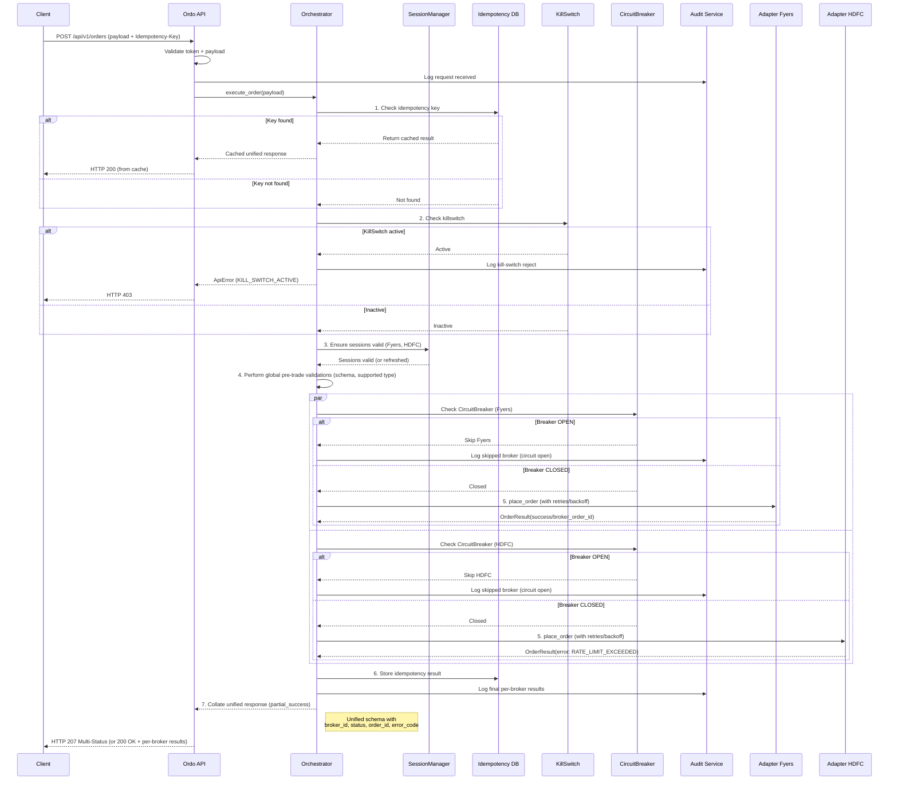

# 7. Core Workflows

This section illustrates key system workflows using sequence diagrams.

## 7.1. Order Placement Workflow (v2)

This diagram details the end-to-end flow for placing an order, including all major components, safety checks, and resilience patterns.

---
